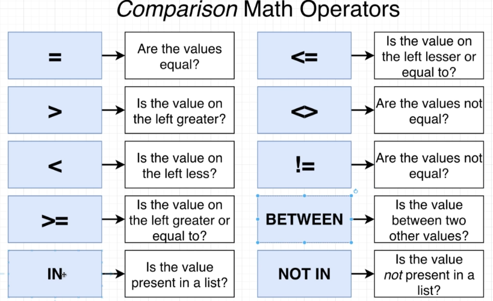

# Filter records

Some math operators


`using BETWEEN`

```sql
SELECT
  *
FROM
  cities
WHERE
  area BETWEEN 2000
  AND 3000;
```

`using IN`

```sql

SELECT
  *
FROM
  cities
WHERE
  name in ('Delhi', 'tokiyo');
```

`using NOT IN`

```sql
SELECT
  *
FROM
  cities
WHERE
  name NOT IN ('Delhi', 'Tokiyo');
```

`Chain query pqrameters using AND and OR`

```sql

SELECT
  *
FROM
  cities
WHERE
  area BETWEEN 2000
  AND 3000
  AND name IN ('Delhi', 'Helsinki');
```

`Arithmatic operation in WHERE`

```sql
SELECT * FROM cities
WHERE population / area >1000;
```

## Update statement

```sql
UPDATE
  cities
SET
  population = 73582635
WHERE
  name = 'Delhi';
```

## Delete statement

```sql
DELETE FROM cities WHERE name='Delhi';
```
